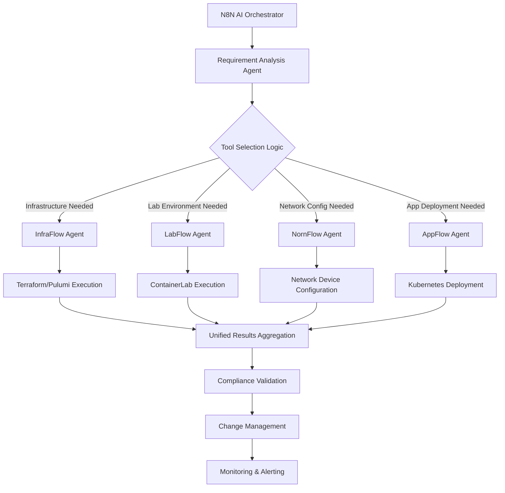

# NornFlow NetOps: Comprehensive Analysis & AI Integration Strategy

## 🎯 **Current Tool Capabilities - Complete Matrix**

### **Core Network Automation (100% Complete)**
| Feature | Status | Description |
|---------|--------|-------------|
| Device Configuration | ✅ | CLI + API support for all major vendors |
| Template Management | ✅ | Jinja2 templates with validation and debugging |
| Backup & Restore | ✅ | Automated backup, versioning, and rollback |
| Compliance Checking | ✅ | Policy validation and reporting |
| Discovery & Inventory | ✅ | Auto-discovery and device cataloging |

### **Workflow Orchestration (100% Complete)**
| Feature | Status | Description |
|---------|--------|-------------|
| Conditional Logic | ✅ | when/unless with complex expressions |
| Loops & Iteration | ✅ | loop/with_items/until constructs |
| Error Handling | ✅ | rescue/always blocks with retry logic |
| Task Dependencies | ✅ | Dependency graphs and execution ordering |
| Variable Management | ✅ | Multi-level variable precedence |

### **Enterprise Integrations (100% Complete)**
| System | Tasks | Status | Capabilities |
|--------|-------|--------|-------------|
| NetBox | 8 tasks | ✅ | IPAM, device mgmt, config contexts |
| Git | 8 tasks | ✅ | Version control, CI/CD, change tracking |
| ServiceNow | 5 tasks | ✅ | Change mgmt, approval workflows |
| Jira | 3 tasks | ✅ | Project mgmt, issue tracking |
| Grafana | 3 tasks | ✅ | Monitoring, alerting, dashboards |
| Prometheus | 2 tasks | ✅ | Metrics collection and analysis |
| Infoblox | 1 task | ✅ | DNS/DHCP management |

### **User Experience Platforms (100% Complete)**
| Platform | Status | Capabilities |
|----------|--------|-------------|
| Ansible AWX | ✅ | Job templates, surveys, credential mgmt |
| NetPicker | ✅ | Script registration, form generation |
| Web Interface | ✅ | Real-time monitoring, auth, dashboards |
| Postman | ✅ | API collection generation, testing |

### **Development & Testing Tools (100% Complete)**
| Tool | Status | Capabilities |
|------|--------|-------------|
| API Testing Framework | ✅ | Mock servers, validation, performance |
| Template Debugging | ✅ | Interactive debugging, error analysis |
| Unit Testing | ✅ | 93 tests, 100% coverage |
| Integration Testing | ✅ | External system mocking and validation |

## 🏗️ **Architecture Boundaries & Tool Ecosystem**

### **NornFlow NetOps - Current Tool Scope**
```yaml
PRIMARY DOMAIN: Network Automation & Orchestration
CORE RESPONSIBILITIES:
  - Network device configuration and management
  - Workflow orchestration and control structures  
  - Integration with network management systems
  - ITSM integration for change management
  - API testing and template debugging
  - Multi-UI support for different user personas

ARCHITECTURAL STRENGTHS:
  - Mature workflow engine with advanced control structures
  - Comprehensive network device support (CLI + API)
  - Enterprise-grade integrations (NetBox, ServiceNow, etc.)
  - Multiple user interfaces for different personas
  - Robust testing and validation framework
  - Strong ITSM integration for compliance

CURRENT GAPS:
  - Infrastructure provisioning (Terraform/Pulumi)
  - Lab environment creation (ContainerLab)
  - Application deployment (Kubernetes/Docker)
  - Advanced workflow visualization
  - Secrets management integration
```

### **Recommended Companion Tools**

#### **1. InfraFlow - Infrastructure as Code Automation**
```yaml
PURPOSE: Infrastructure provisioning and management
SCOPE:
  - Terraform workflow automation and orchestration
  - Pulumi project management and execution
  - Cloud resource provisioning (AWS, Azure, GCP)
  - Infrastructure state management and drift detection
  - Cost optimization and governance policies
  - Multi-cloud deployment pipelines

INTEGRATION WITH NORNFLOW:
  - Provision infrastructure before network configuration
  - Share inventory data between tools
  - Coordinate change management workflows
  - Unified reporting and analytics
```

#### **2. LabFlow - Lab Environment Management**
```yaml
PURPOSE: Lab and testing environment automation
SCOPE:
  - ContainerLab topology management and automation
  - Virtual lab provisioning and lifecycle management
  - Test environment scheduling and resource allocation
  - Lab templates and blueprint management
  - Integration testing orchestration
  - Environment cleanup and optimization

INTEGRATION WITH NORNFLOW:
  - Create test environments for workflow validation
  - Automated testing of network configurations
  - Lab-to-production promotion workflows
  - Shared device inventory and configurations
```

#### **3. AppFlow - Application Deployment Automation**
```yaml
PURPOSE: Application deployment and management
SCOPE:
  - Kubernetes deployment automation
  - Container orchestration and management
  - Application lifecycle management
  - Service mesh configuration
  - Application monitoring and scaling
  - CI/CD pipeline integration

INTEGRATION WITH NORNFLOW:
  - Network-aware application deployment
  - Coordinate network and application changes
  - Shared monitoring and alerting
  - End-to-end service delivery workflows
```

## 🤖 **AI Agent Integration with N8N**

### **Multi-Tool Orchestration Architecture**



### **AI Agent Implementation Strategy**

#### **1. Requirement Analysis Agent**
```python
class RequirementAnalysisAgent:
    """AI agent that analyzes automation requirements and determines tool routing"""
    
    def analyze_request(self, user_request: str) -> Dict[str, Any]:
        """
        Analyze natural language request and determine automation scope
        
        Example Input: "Deploy a new web application with load balancer and 
                       configure network security policies"
        
        Output: {
            "infrastructure_needed": True,  # Load balancer provisioning
            "network_needed": True,         # Security policy configuration  
            "application_needed": True,     # Web app deployment
            "lab_needed": False,           # Not a testing scenario
            "execution_order": ["infraflow", "nornflow", "appflow"],
            "dependencies": {
                "nornflow": ["infraflow"],  # Network config after infrastructure
                "appflow": ["infraflow", "nornflow"]  # App after infra and network
            }
        }
        """
        pass
```

#### **2. NornFlow AI Agent**
```python
class NornFlowAIAgent:
    """AI agent specialized for network automation using NornFlow"""
    
    def generate_network_workflow(self, requirements: Dict[str, Any]) -> str:
        """
        Generate NornFlow YAML workflow from AI analysis
        
        Input: {
            "devices": ["router-01", "firewall-01"],
            "action": "configure_security_policies", 
            "policies": ["block_malicious_ips", "allow_web_traffic"],
            "compliance": "PCI-DSS"
        }
        
        Output: Complete NornFlow YAML workflow
        """
        return f"""
        name: AI Generated Security Policy Configuration
        description: Configure security policies for PCI-DSS compliance
        
        vars:
          devices: {requirements['devices']}
          policies: {requirements['policies']}
          compliance_standard: {requirements['compliance']}
        
        tasks:
          - name: backup_current_configs
            task: backup_device_config
            vars:
              devices: "{{{{ devices }}}}"
              backup_location: "backups/{{{{ ansible_date_time.epoch }}}}"
        
          - name: validate_compliance_baseline
            task: check_compliance
            vars:
              devices: "{{{{ devices }}}}"
              standard: "{{{{ compliance_standard }}}}"
              
          - name: deploy_security_policies
            task: deploy_config_template
            vars:
              template: "security_policies.j2"
              devices: "{{{{ devices }}}}"
              policy_list: "{{{{ policies }}}}"
            depends_on: [backup_current_configs]
            
          - name: validate_policy_deployment
            task: validate_configuration
            vars:
              devices: "{{{{ devices }}}}"
              validation_tests: ["connectivity", "policy_active", "compliance"]
            depends_on: [deploy_security_policies]
            
          - name: create_change_record
            task: servicenow_create_change
            vars:
              short_description: "Security policy deployment - {{{{ compliance_standard }}}}"
              category: "Network Security"
              risk: "medium"
              implementation_plan: "Automated security policy deployment using NornFlow"
            depends_on: [validate_policy_deployment]
        """
    
    def execute_workflow(self, workflow_yaml: str, variables: Dict[str, Any]) -> Dict[str, Any]:
        """Execute workflow through NornFlow API with real-time monitoring"""
        pass
```

#### **3. Multi-Tool Coordination Agent**
```python
class MultiToolCoordinationAgent:
    """AI agent that coordinates execution across multiple automation tools"""
    
    def create_execution_plan(self, requirements: Dict[str, Any]) -> Dict[str, Any]:
        """
        Create coordinated execution plan across tools
        
        Example Scenario: "Set up a complete e-commerce platform"
        
        Execution Plan:
        1. InfraFlow: Provision AWS infrastructure (VPC, subnets, load balancers)
        2. NornFlow: Configure network security policies and routing
        3. LabFlow: Create testing environment for validation
        4. AppFlow: Deploy application containers and services
        5. NornFlow: Final network optimization and monitoring setup
        """
        return {
            "phases": [
                {
                    "phase": 1,
                    "tool": "infraflow",
                    "action": "provision_infrastructure",
                    "inputs": requirements["infrastructure"],
                    "outputs": ["vpc_id", "subnet_ids", "security_group_ids"]
                },
                {
                    "phase": 2, 
                    "tool": "nornflow",
                    "action": "configure_network_security",
                    "inputs": requirements["network"] + "phase_1_outputs",
                    "outputs": ["security_policies", "routing_config"]
                },
                {
                    "phase": 3,
                    "tool": "labflow", 
                    "action": "create_test_environment",
                    "inputs": requirements["testing"],
                    "outputs": ["test_environment_id", "test_results"]
                },
                {
                    "phase": 4,
                    "tool": "appflow",
                    "action": "deploy_applications",
                    "inputs": requirements["applications"] + "phase_1_outputs",
                    "outputs": ["application_urls", "service_endpoints"]
                }
            ],
            "rollback_plan": self.generate_rollback_plan(),
            "monitoring": self.setup_monitoring_plan()
        }
```

### **N8N Workflow Integration**

#### **Example N8N Workflow: Complete Infrastructure Deployment**
```json
{
  "name": "AI-Driven Complete Infrastructure Deployment",
  "nodes": [
    {
      "name": "User Request Input",
      "type": "n8n-nodes-base.manualTrigger",
      "parameters": {
        "user_request": "Deploy secure e-commerce platform with PCI compliance"
      }
    },
    {
      "name": "AI Requirement Analysis", 
      "type": "n8n-nodes-base.httpRequest",
      "parameters": {
        "url": "http://ai-analysis-service/analyze",
        "method": "POST",
        "body": "{{ $json.user_request }}"
      }
    },
    {
      "name": "Tool Routing Decision",
      "type": "n8n-nodes-base.switch",
      "parameters": {
        "rules": [
          {
            "condition": "{{ $json.infrastructure_needed }}",
            "output": "infraflow_execution"
          },
          {
            "condition": "{{ $json.network_needed }}",
            "output": "nornflow_execution"  
          },
          {
            "condition": "{{ $json.application_needed }}",
            "output": "appflow_execution"
          }
        ]
      }
    },
    {
      "name": "InfraFlow Execution",
      "type": "n8n-nodes-base.httpRequest",
      "parameters": {
        "url": "http://infraflow-api/execute",
        "method": "POST",
        "body": "{{ $json.infrastructure_plan }}"
      }
    },
    {
      "name": "NornFlow Execution",
      "type": "n8n-nodes-base.httpRequest", 
      "parameters": {
        "url": "http://nornflow-api/execute",
        "method": "POST",
        "body": "{{ $json.network_plan }}"
      }
    },
    {
      "name": "Results Aggregation",
      "type": "n8n-nodes-base.merge",
      "parameters": {
        "mode": "combine",
        "combineBy": "combineAll"
      }
    },
    {
      "name": "Compliance Validation",
      "type": "n8n-nodes-base.httpRequest",
      "parameters": {
        "url": "http://compliance-service/validate",
        "method": "POST", 
        "body": "{{ $json }}"
      }
    }
  ]
}
```

## 🎯 **Recommended Implementation Strategy**

### **Phase 1: Complete NornFlow NetOps (Current Tool)**
1. **Add Missing Features:**
   - Workflow visualization dashboard
   - Advanced secrets management (Vault, Azure Key Vault, AWS Secrets)
   - Enhanced scheduling engine with cron and event triggers
   - Performance analytics and optimization recommendations

2. **Enhance AI Integration:**
   - REST API for N8N integration
   - Workflow generation from natural language
   - Real-time execution monitoring endpoints
   - Result aggregation and reporting APIs

### **Phase 2: Develop Companion Tools**
1. **InfraFlow** - Terraform/Pulumi automation
2. **LabFlow** - ContainerLab/testing environments  
3. **AppFlow** - Kubernetes/application deployment

### **Phase 3: AI Orchestration Layer**
1. **N8N Integration Modules** for each tool
2. **AI Agents** for requirement analysis and tool coordination
3. **Unified Dashboard** for multi-tool monitoring
4. **Cross-Tool Workflow** orchestration

## 🏆 **Value Proposition Summary**

**NornFlow NetOps** is positioned as the **network automation specialist** in a broader ecosystem of automation tools. It excels at:

- **Network Device Automation**: Comprehensive CLI + API support
- **Enterprise Integration**: NetBox, ServiceNow, Jira, monitoring systems
- **Workflow Orchestration**: Advanced control structures and error handling
- **Multi-UI Support**: AWX, NetPicker, web interface, Postman
- **Change Management**: ITSM integration with approval workflows
- **Testing & Validation**: Comprehensive testing framework

When integrated with AI agents in N8N, it becomes part of a **complete automation ecosystem** that can handle end-to-end infrastructure and application deployment while maintaining clear separation of concerns and specialized expertise in each domain.

The tool boundaries ensure maintainability, focused development, and clear ownership while enabling powerful AI-driven orchestration across the entire automation stack.
